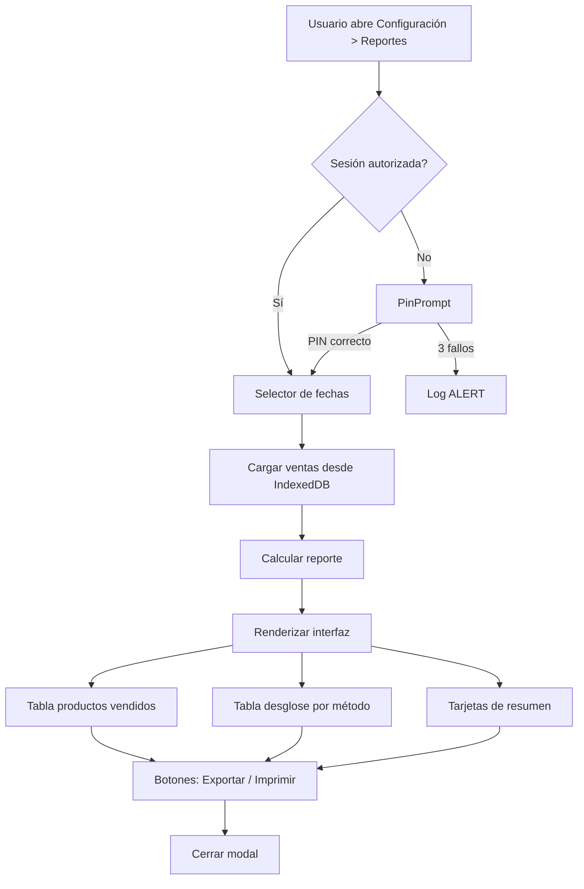

# 09 — Administración y Analítica

> **Estado:** 🔍 En análisis
> **Prioridad:** Media
> **Depende de:** 05

---

## 🎯 Objetivo

Proveer herramientas de administración y cierre de caja: reportes financieros, desglose por método de pago, filtros de fecha y exportación de datos.

---

## Pendiente / Ideas

### Desglose Financiero en Resumen
- El resumen de ventas debe totalizar el dinero clasificado por cada método de pago:
  - Efectivo $
  - Efectivo Bs
  - Pago Móvil
  - Punto/Divisa
- Mostrar subtotales por método y gran total

### Filtro de Fechas
- Selector de calendario en el resumen diario
- Presets: Hoy, Ayer, Esta Semana, Este Mes, Personalizado
- Permitir auditorías de días anteriores, semanas o meses

### Validación de Decimales y Ceros
- Corregir errores de truncado: ítems con 0 unidades pero con ingresos generados
- Ejemplo reportado: caso de la lechuga
- Revisar redondeo en `formatCurrency()` y `formatQty()`

### Reportes adicionales (futuro)
- [ ] Productos más vendidos (top 10)
- [ ] Ventas por categoría
- [ ] Ventas por hora del día (picos de atención)
- [ ] Comparativa vs semana anterior
- [ ] Ticket promedio
- [ ] Exportar a PDF (descargable)

---

## Diseño Técnico Propuesto

### Estructura del reporte

```javascript
const reporte = {
  rango: { desde: "2026-07-01", hasta: "2026-07-30" },
  resumen: {
    totalVentas: 150,
    totalUSD: 1250.00,
    totalBS: 91875.00,
    ticketPromedioUSD: 8.33,
  },
  metodosPago: {
    efectivoUSD: 450.00,
    efectivoBS: 18000.00,
    pagoMovilUSD: 500.00,
    pagoMovilBS: 36750.00,
    puntoUSD: 200.00,
    puntoBS: 14700.00,
    divisaUSD: 100.00,
  },
  igtfTotal: {
    aplicado: false,
    montoBS: 0,
  },
  productos: [
    { nombre: "Lechuga", cantidad: 45, totalUSD: 67.50 },
    // ...
  ]
}
```

---

## 🖼️ Mockup de la Interfaz

```
┌────────────────────────────────────────────────────────────┐
│  📊 Resumen de Ventas                          [✕] Cerrar  │
├────────────────────────────────────────────────────────────┤
│  📅 Período: [2026-07-01] al [2026-07-30]                 │
│  [Hoy] [Ayer] [Semana] [Mes] [Personalizado]              │
├────────────────────────────────────────────────────────────┤
│  ┌────────────────────┐  ┌────────────────────┐           │
│  │  Total Ventas      │  │  Ticket Promedio   │           │
│  │  150 operaciones   │  │  $8,33             │           │
│  └────────────────────┘  └────────────────────┘           │
│  ┌────────────────────┐  ┌────────────────────┐           │
│  │  Total USD         │  │  Total Bs          │           │
│  │  $1.250,00         │  │  Bs 91.875,00      │           │
│  └────────────────────┘  └────────────────────┘           │
├────────────────────────────────────────────────────────────┤
│  💰 Desglose por Método de Pago                            │
│                                                           │
│  Método             USD          Bs          Total        │
│  ─────────────────────────────────────────────────────     │
│  Efectivo $     │  $450,00  │      —    │  $450,00       │
│  Efectivo Bs    │      —    │ Bs 18.000 │  Bs 18.000     │
│  Pago Móvil     │  $500,00  │ Bs 36.750 │  $500 + Bs...  │
│  Punto          │  $200,00  │ Bs 14.700 │  $200 + Bs...  │
│  Divisa         │  $100,00  │      —    │  $100,00       │
│  ─────────────────────────────────────────────────────     │
│  TOTALES        │ $1.250,00 │ Bs 69.450 │                │
│                                                           │
│  IGTF 3%:  No aplicado                                    │
├────────────────────────────────────────────────────────────┤
│  📋 Productos Vendidos                       Buscar... 🔍 │
│                                                           │
│  # │ Producto    │ Cant │ Total USD │ Total Bs           │
│  ───┼────────────┼──────┼───────────┼───────────          │
│  1  │ Lechuga    │  45  │  $67,50   │ Bs 4.961            │
│  2  │ Tomate     │  30  │  $45,00   │ Bs 3.307            │
│  3  │ Cebolla    │  25  │  $37,50   │ Bs 2.756            │
│  ...│ ...        │ ...  │  ...      │ ...                 │
│                                                           │
│  [← Anterior]  Página 1 de 5  [Siguiente →]              │
├────────────────────────────────────────────────────────────┤
│  [📥 Exportar CSV]          [🖨️ Imprimir Reporte]         │
└────────────────────────────────────────────────────────────┘
```

### Flujo de navegación



### Secciones de la interfaz

| Sección | Contenido |
|---------|-----------|
| **Barra superior** | Selector de fechas con presets (Hoy, Ayer, Semana, Mes, Personalizado) |
| **Tarjetas de resumen** | 4 tarjetas: Total Ventas, Ticket Promedio, Total USD, Total Bs |
| **Desglose por método** | Tabla con columnas: Método, USD, Bs, Total. Incluye IGTF |
| **Productos vendidos** | Tabla paginada con búsqueda. Columnas: #, Producto, Cant, Total USD, Total Bs |
| **Barra de acciones** | Exportar CSV + Imprimir Reporte |

---

## Archivos Relacionados

- `src/components/SalesReportModal.jsx` + `SalesReportModal.css`
- `src/components/SettingsModal.jsx`
- `src/utils/db.js` (store `sales`)
- `src/utils/format.js`
