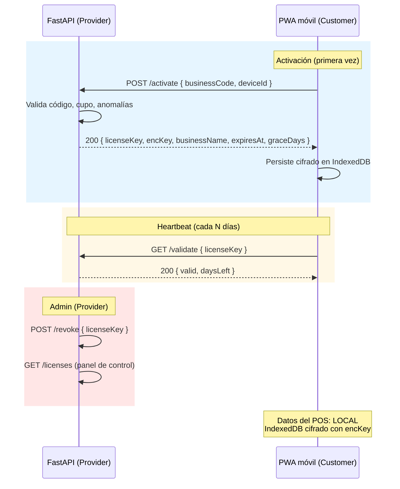

# 14.1 — Licenciamiento Remoto con FastAPI (SaaS con Backend Propio)

> **Estado:** 💡 Idea
> **Prioridad:** Alta
> **Extiende:** [14-proteccion-copias.md](14-proteccion-copias.md)
> **Inversión de paradigma:** pasar de "app offline con licencias locales" a "app con backend propio para licenciamiento remoto"

---

## 🎯 Objetivo

Evolucionar la estrategia de protección de **licenciamiento puramente local** (RSA, fingerprint) hacia un modelo **SaaS con backend FastAPI** que:

- Mantenga la promesa **offline-first** del POS (los datos del negocio nunca salen del dispositivo).
- Use el backend **únicamente como autoridad de licenciamiento** (activar, validar, revocar, detectar anomalías).
- Permita al Provider gestionar múltiples clientes/negocios desde un panel central.
- Entregue **bloqueo real**, no solo fricción.

---

## 🧭 Cambio de Paradigma

| Aspecto | [14 — Modelo Offline](14-proteccion-copias.md) | **14.1 — Modelo SaaS con FastAPI** |
|---------|-----------------------------------------------|-------------------------------------|
| Servidor central | ❌ No existe | ✅ FastAPI del Provider |
| Datos del POS | Locales (IndexedDB) | **Locales (IndexedDB)** — sin cambios |
| Licencia | Firmada offline con RSA | Generada y validada vía backend |
| Revocación | ❌ Imposible sin que el cliente actualice | ✅ Inmediata desde el panel admin |
| Multi-tenant | ❌ Una licencia = un deviceId | ✅ Un `businessCode` puede autorizar N devices |
| Costo infra | $0 | Coste de un VPS / serverless |
| Bloqueo real | Fricción (parcheable) | **Real** (el backend deja de responder) |

**Conclusión:** los datos siguen 100% locales. El backend FastAPI **solo maneja identidad, licencias y revocación**. La promesa offline se preserva con un *grace period* generoso.

---

## 🏗️ Arquitectura Propuesta

### Diagrama de flujo (Mermaid)



### Diagrama en ASCII (verificado, flechas correctas)

```
[FastAPI]                                    [PWA móvil]
   │                                              │
   │  POST /activate (deviceFingerprint)          │
   │ ◄─────────────────────────────────────────   │
   │                                              │
   │  200 { licenseKey, encKey,                   │
   │       businessName, expiresAt }              │
   │ ─────────────────────────────────────────►   │
   │                                              │
   │  GET /validate (licenseKey)                  │
   │ ◄─────────────────────────────────────────   │
   │                                              │
   │  200 { valid: true, daysLeft: 7 }            │
   │ ─────────────────────────────────────────►   │
   │                                              │
   │      POST /revoke                            │
   │      [interno — admin vía panel]             │
   │                                              │
   │      Datos del POS: 100% LOCAL               │
   │      (IndexedDB cifrado con encKey)          │
```

---

## 🎭 Secuencia Completa (relato funcional)

### Acto 1 — El acuerdo (offline, entre humanos)

1. Provider y Customer se conocen, charlan, ven la app, acuerdan el servicio.
2. Provider registra al Customer en su panel: `nombre`, `maxDevices`, `expiration`.
3. El sistema genera un `businessCode` único (ej. `FRUT-A7K3-9XQ2`).
4. Provider envía el `businessCode` al Customer por WhatsApp o en persona.
5. Provider también envía: URL de Vercel + password de Vercel.

### Acto 2 — Primera apertura en el teléfono del Customer

1. Customer abre la URL de Vercel en su móvil.
2. Ingresa la password de Vercel → la PWA carga.
3. PWA arranca, revisa IndexedDB: no hay `licenseKey` → muestra pantalla de **Activación**.
4. PWA pide el `businessCode`. Customer lo escribe.
5. PWA genera un `deviceFingerprint` (UA + screen + timezone + language + canvas + hardware), hasheado con SHA-256 → `deviceId` estable.
6. PWA llama al backend: `POST /activate { businessCode, deviceId }`.

### Acto 3 — Validación en el FastAPI del Provider

7. FastAPI valida la solicitud en este orden:
   - ¿`businessCode` existe? **No** → 404 "Código inválido".
   - ¿Negocio activo? **No** → 403 "Negocio desactivado".
   - ¿`deviceId` ya registrado para este negocio? **Sí** → idempotente, devuelve la misma key.
   - ¿Cupo (`maxDevices`) lleno? **Sí** → 409 "Contacta al administrador".
   - ¿Todo OK? → genera las claves.
8. FastAPI genera:
   - `encKey` = random AES-256 (32 bytes) → cifra datos locales del Customer.
   - `licenseKey` = `sign(deviceId + businessCode + expiresAt, serverSecret)` → prueba de autorización.
   - Almacena en DB: `{ businessCode, deviceId, licenseKey_hash, encKey_hash, createdAt, lastSeen, status }`.
   - ⚠️ **Nunca** guarda `encKey` en plaintext en el backend, solo su hash (para verificación).
9. FastAPI responde: `200 { licenseKey, encKey, businessName, expiresAt, graceDays: 14 }`.

### Acto 4 — Customer ya opera

10. PWA guarda `licenseKey`, `encKey`, `businessName`, `expiresAt` en IndexedDB (cifrado en reposo).
11. PWA transiciona a la pantalla principal del POS.
12. Cada N días (configurable, ej. 7): PWA hace `GET /validate` (heartbeat silencioso).
    - Si backend responde `valid: true` → todo sigue igual.
    - Si backend responde `valid: false` o no responde durante el `graceDays` → modo degradado.

---

## 🛡️ Defensa en Profundidad — Capas Recomendadas

| # | Capa | Impacto | Costo |
|---|------|---------|-------|
| 1 | **Backend como chokepoint** — el FastAPI puede rehusar servicio, bloqueando el frontend | ████████ | bajo |
| 2 | **Despliegue por cliente** — cada Customer con su propio subdominio/deploy de Vercel | ████████ | medio |
| 3 | **Heartbeat con grace period** — la app degrada si no valida en N días | ███████░ | bajo |
| 4 | **Watermarking por cliente** — `customerId` embebido en el bundle, permite rastrear filtraciones | ██████░░ | bajo |
| 5 | **Detección de anomalías** — misma licenseKey desde IPs distintas, activaciones masivas, etc. | ██████░░ | medio |
| 6 | **Ofuscación del bundle** — `vite-plugin-javascript-obfuscator` | ████░░░░ | bajo |
| 7 | **Legal** — EULA + contrato + procedimiento de takedown | ███░░░░░ | bajo |
| 8 | **Atractivo de la suscripción** — updates, soporte, dashboard, sync opcional | ███████░ | continuo |

**Top 3 críticas:** backend como chokepoint + despliegue por cliente + heartbeat = ~80% de la protección real.

---

## 🧠 El Caso del "Customer que Comparte Credenciales"

**Sí, el Customer puede pasarle sus credenciales a un amigo**, limitado por el cupo (`maxDevices`). Esto es estructural al `businessCode` como credencial compartible.

### Tres niveles de protección

| Nivel | Mecanismo | Protege contra | Costo UX |
|-------|-----------|----------------|----------|
| **1 — Solo cupo** | `maxDevices = 1` o `2` | sharing masivo | ninguno |
| **2 — Aprobación manual** | PWA queda en "esperando aprobación del Provider" hasta que el admin confirma desde el panel | cualquier sharing | alta (espera minutos/horas) |
| **3 — Doble factor** | Backend envía código de 6 dígitos por WhatsApp/SMS al número del Customer registrado | cualquier sharing | medio (requiere integración WhatsApp API / Twilio) |

### Decisión recomendada para empezar

**Nivel 1** (cupo) es suficiente para MVP. Subir a Nivel 2 si la piratería se vuelve un problema real. Nivel 3 solo si el modelo es B2C masivo.

---

## 🧩 Endpoints del Backend (borrador)

| Método | Ruta | Función | Quién llama |
|--------|------|---------|-------------|
| `POST` | `/activate` | Emite `licenseKey` + `encKey` para un `(businessCode, deviceId)` | PWA |
| `GET` | `/validate` | Heartbeat: confirma vigencia, devuelve `daysLeft` | PWA |
| `POST` | `/revoke` | Invalida una `licenseKey` | Panel admin |
| `GET` | `/licenses` | Lista de activaciones (filtros por negocio, status, fecha) | Panel admin |
| `POST` | `/businesses` | Crea un nuevo negocio (genera `businessCode`) | Panel admin |
| `PATCH` | `/businesses/{id}` | Actualiza `maxDevices`, `expiration`, `status` | Panel admin |
| `GET` | `/businesses/{id}/devices` | Lista devices de un negocio | Panel admin |
| `DELETE` | `/devices/{id}` | "Mata" la licencia de un device (libera cupo) | Panel admin |

### Auth del admin

Opciones a evaluar:
- **API key** en header (simple, suficiente para uso interno)
- **Basic auth** (simple pero poco seguro)
- **JWT** con login + refresh (más robusto, recomendado a mediano plazo)
- **OAuth con GitHub** (si el panel vive en Vercel y se accede desde la misma org)

---

## ❓ Decisiones Pendientes

| # | Pregunta | Opciones |
|---|----------|----------|
| 1 | ¿Dónde corre el FastAPI? | VPS propio (Hetzner/DO) / Railway / Render / Fly.io / server en LAN |
| 2 | ¿Multi-tenant o single-tenant? | Varios negocios (SaaS) vs. uno propio |
| 3 | ¿Modelo de expiración? | Perpetuo / anual / mensual / trial 30 días |
| 4 | ¿Período de gracia offline? | 7 / 14 / 30 días |
| 5 | ¿Acción al vencer grace? | Bloqueo total / modo lectura / solo warning |
| 6 | ¿Frecuencia de heartbeat? | 3 / 7 / 14 días |
| 7 | ¿Auth del panel admin? | API key / Basic / JWT / OAuth |
| 8 | ¿Acción al revocar? | Inmediata / próximo heartbeat |
| 9 | ¿Reactivación tras reset del móvil? | Nueva key del Provider / reutilizar `businessCode` |
| 10 | ¿Suscripción atractiva (Nivel 8)? | Sync opcional / dashboard nube / soporte prioritario |

---

## 📝 Plan de Implementación (orden sugerido)

### Fase 0 — Decisiones de diseño (1 día)
Cerrar las 10 preguntas pendientes. De ellas depende toda la implementación.

### Fase 1 — Backend mínimo (3-5 días)
- Repo separado `fruteria-pos-backend` con FastAPI
- DB: SQLite (start) → PostgreSQL (cuando escale)
- Endpoints: `POST /activate`, `GET /validate`
- Panel admin mínimo (CLI al inicio, web después)
- Variables de entorno para `serverSecret`

### Fase 2 — Integración con PWA (3-5 días)
- Pantalla de activación en `App.jsx`
- Generación de `deviceFingerprint` en `src/utils/fingerprint.js`
- Cliente HTTP en `src/utils/api.js` con manejo de errores
- Persistencia de `licenseKey` en IndexedDB
- Heartbeat silencioso (intervalo configurable)

### Fase 3 — Panel admin (3-7 días)
- CRUD de negocios
- Lista de devices por negocio
- Acciones: revocar, extender grace, cambiar `maxDevices`
- Logs de actividad
- Alertas de anomalías

### Fase 4 — Hardening (continuo)
- Watermarking por cliente en el build (Vite plugin custom)
- Obfuscación del bundle
- Checksum / anti-tamper checks
- Rate limiting en endpoints

---

## ⚠️ Honestidad sobre los Límites

> **El frontend nunca es 100% seguro.** Cualquier bundle JS puede descompilarse, parcharse y redistribuirse. Incluso Adobe, Microsoft y Netflix pierden esa batalla.
>
> La estrategia correcta no es "impedir la piratería" sino **hacer que piratear sea más caro que suscribirse**. El backend es la palanca: si deja de responder, la copia pirata deja de funcionar, perder datos o soporte.
>
> La fórmula ganadora: **backend como autoridad + heartbeat + suscripción con valor real (updates, soporte, features).**

---

## 🔗 Relacionado

- [14-proteccion-copias.md](14-proteccion-copias.md) — modelo offline con RSA (la base anterior)
- [13-identificacion-app.md](13-identificacion-app.md) — generación de `deviceId` (reutilizable)
- [15-hasheo-configuracion.md](15-hasheo-configuracion.md) — cifrado de datos locales con `encKey`
- [12-arquitectura-sistema.md](12-arquitectura-sistema.md) — arquitectura general de la PWA
- [17-distribucion-monetizacion.md](17-distribucion-monetizacion.md) — modelo de negocio que define el nivel de SaaS
