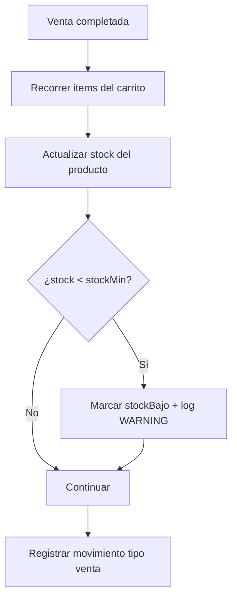

# 19 — Módulo de Inventario

> **Estado:** 🔄 Diseño definido (faltan detalles de implementación)
> **Prioridad:** Alta
> **Depende de:** 08, 05, 10, 21
> **Bloquea:** 09 (validación de decimales/ceros) — debe resolverse antes de Fase 1

---

## 🎯 Objetivo

Agregar control de stock (cantidad disponible) a los productos, permitir registrar entradas de mercancía, ajustes manuales y descontar inventario automáticamente al vender. El módulo debe alertar sobre productos bajos o agotados.

---

## Contexto Actual

- Los productos no tienen campo de stock (`src/data/products.js` solo tiene name, icon, group, um, price, ramo)
- La venta registra ítems en el store `sales` (IndexedDB) sin afectar inventario
- La validación de decimales/ceros está pendiente (ver [09-administracion-analitica.md](09-administracion-analitica.md)): ítems con 0 unidades pero con ingresos — **el inventario depende de resolver esto**
- El store `products` en IndexedDB (`fruteria-db` v6) almacena los productos actuales

---

## Alcance Propuesto

### Fase 1 — Stock básico

- Campo `stock` en cada producto (cantidad decimal, según `um`)
- Pantalla de inventario en Configuración: tabla con producto, um, stock actual, estado
- Ajuste manual de stock (entradas de mercancía, mermas)
- Descuento automático de stock al completar una venta
- Restauración de stock al eliminar una venta

### Fase 2 — Control de nivel

- Umbral mínimo por producto → alerta de "stock bajo"
- Badge visible en la cuadrícula de productos del POS
- Historial de movimientos: fecha, tipo (entrada/salida/ajuste), cantidad, motivo, usuario
- Reporte de inventario (integrable con [09-administracion-analitica.md](09-administracion-analitica.md))

### Fase 3 — Costo y márgenes (post-MVP)

- Campo `costoPromedio` en producto + recálculo en cada entrada con costo
- Base para futuro cálculo de margen (deliberadamente fuera del MVP — no convertir en ERP)

### Fase 4 — Decisiones comerciales (por evaluar)

- ¿Permitir vender sin stock (venta rápida frutería) o bloquear el botón?
- ¿Unidades de inventario por kg, unidad o ambos?
- ¿Ajuste automático por merma diaria (frutas/verduras perecederas)?

---

## Diseño Técnico Propuesto

### Estructura del producto extendido

```javascript
{
  id: 1,
  name: 'Lechuga',
  icon: '🥬',
  group: 'verduras',
  um: 'unidad',
  price: 0.80,
  ramo: 'fruteria',
  stock: 0,          // nuevo: cantidad disponible
  stockMin: 0,       // nuevo: umbral de alerta
  stockBajo: false,  // nuevo: flag calculado o derivado
}
```

### Store de movimientos (IndexedDB)

```javascript
// Store: inventory_movements (nuevo en db.js)
{
  id: autoIncrement,
  productId: 1,
  tipo: 'entrada' | 'salida' | 'ajuste' | 'venta',
  cantidad: 5.5,
  motivo: 'Compra al mayorista' | 'Venta #123' | 'Merma',
  timestamp: '2026-07-31T10:00:00.000Z',
}
```

### Flujo de descuento en venta



### Restauración al eliminar venta

- Al eliminar una venta desde el histórico → sumar de vuelta el stock
- Registrar movimiento tipo `ajuste` con motivo "Anulación de venta #id"

---

## Interfaz Propuesta

### Ubicación en la app

Inventario vive como **entrada del SideMenu** (no como pestaña en topbar), con **separador visual arriba y abajo** que lo aísla como sección propia entre la gestión de productos y los reportes.

```
📂 Categorías de Producto
📦 Catálogo de Productos
─────────────
📊 Inventario            ← nuevo (icono: 📊)
─────────────
📈 Reporte de Ventas
─────────────
💱 Tasa BCV
─────────────
⚙️ Configuración de Sistema
📋 Visor de Logs
─────────────
🔒 Bloquear ahora
```

- Hereda la regla de visibilidad del sidemenu: **admin-only con sesión activa** (ver [21-sidemenu-navegacion.md](21-sidemenu-navegacion.md)).
- Icono `📊` (no choca con `📈` de Reporte de Ventas ni con `📦` de Catálogo).

### Pantalla de Inventario

```
┌──────────────────────────────────────────────────────────┐
│  📊 Inventario                            [✕] Cerrar     │
├──────────────────────────────────────────────────────────┤
│  [Buscar producto...]        [Filtro: Todo|Bajo|Agotado] │
│                                                          │
│  Producto        │ U/M     │ Stock   │ Estado            │
│  ────────────────┼─────────┼─────────┼─────────────────  │
│  Lechuga    🥬   │ unidad  │  45     │ ✅ OK             │
│  Tomate     🍅   │ kg      │  3,5    │ ⚠️ Stock bajo      │
│  Aguacate   🥑   │ kg      │  0      │ ❌ Agotado         │
│                                                          │
│  [＋ Entrada]  [✎ Ajustar]  [🗑️ Merma]                  │
├──────────────────────────────────────────────────────────┤
│  📜 Historial de movimientos (fecha, tipo, cantidad)     │
└──────────────────────────────────────────────────────────┘
```

### Banner de alertas (independiente de la pantalla)

Al abrir la app o al finalizar el día, mostrar un modal-resumen con productos bajo mínimo:

```
┌─────────────────────────────────────────┐
│  ⚠️ 3 productos con stock bajo           │
│                                         │
│  🔴 Plátano     3.2 kg  (mín: 5 kg)     │
│  🔴 Aguacate    0.8 kg  (mín: 3 kg)     │
│  🔴 Fresa       1.1 kg  (mín: 2 kg)     │
│                                         │
│  [Ir a inventario]  [Ignorar]           │
└─────────────────────────────────────────┘
```

Este banner se calcula al vuelo (no requiere flag `stockBajo` persistente en producto).

---

## Preguntas Abiertas

- [ ] ¿El stock aplica por ramo comercial o es global?
- [ ] ¿Es necesaria la merma automática para perecederos?
- [ ] ¿Se integra con el resumen de ventas (productos vendidos vs stock restante)?
- [ ] ¿El botón de venta debe deshabilitarse si `stock === 0`?
- [ ] ¿El banner de alertas debe ser obligatorio (no descartable) o solo informativo?

---

## Relacionado

- Ver [08-gestion-productos-categorias.md](Done/08-gestion-productos-categorias.md) — producto sin stock hoy (pendiente)
- Ver [05-historico-ventas.md](05-historico-ventas.md) — anulación de ventas (restaura stock)
- Ver [09-administracion-analitica.md](09-administracion-analitica.md) — validación de decimales/ceros
- Ver [10-persistencia-bases-datos.md](10-persistencia-bases-datos.md) — esquema IndexedDB

---

## Archivos Relacionados

- `src/data/products.js` (datos semilla)
- `src/utils/db.js` (stores `products`, `sales`; se agregaría `inventory_movements`)
- `src/components/Products.jsx` (gestión de productos)
- `src/components/Inventory.jsx` + CSS (nuevo)
- `src/components/SideMenu.jsx` (alta de entrada + separadores)
- `src/App.jsx` (flujo de venta + estado elevado del modal de Inventario)
