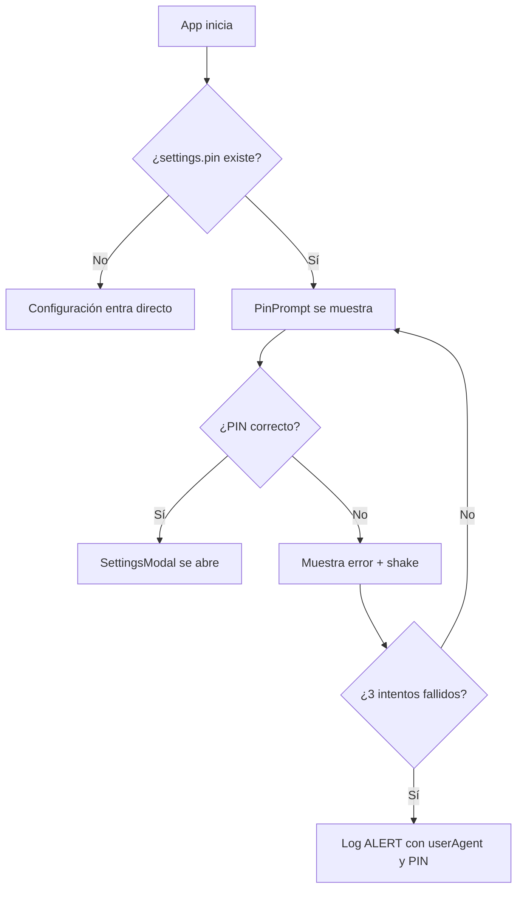

# 20 — Funcionamiento del PIN

> **Estado:** 🛡️ Implementado
> **Prioridad:** Alta
> **Depende de:** 07, 15

---

## 🎯 Objetivo

Documentar el ciclo completo del PIN de administrador: configuración, hasheo, validación, bloqueo de acceso y registro de intentos fallidos.

---

## Flujo General



---

## Configuración del PIN

### Desde Configuración
- Campo de texto (solo dígitos, máx. 6) en `SettingsModal`
- Botón 👁️/🙈 para mostrar/ocultar
- Mínimo 4 dígitos, máximo 6
- Hint "Mín. 4 dig." si se escriben menos de 4
- Badge "✓ Configurado" si ya existe un PIN
- Si se deja vacío conservando uno existente → se mantiene el actual

### Persistencia
- Se guarda **hasheado** (SHA-256 hex, 64 caracteres) en `localStorage`
- Clave: `fruteria-settings` → propiedad `pin`
- Nunca se persiste en texto plano

---

## Hasheo (`src/utils/hash.js`)

- SHA-256 mediante Web Crypto API (`crypto.subtle.digest`)
- Fallback a hash simple de 32 bits en entornos sin Web Crypto
- `hashPin(pin)` devuelve string hex

---

## Validación en PinPrompt (`src/components/PinPrompt.jsx`)

### Detección del formato
- `isHashed` = regex `/^[0-9a-f]{64}$/` sobre el PIN almacenado
- Si está hasheado → longitud esperada = 6 (no se puede saber la real)
- Si es texto plano (legacy) → longitud = la del PIN almacenado
- Compatibilidad hacia atrás con PINs guardados antes del hasheo

### Teclado numérico
- 4 filas: 1-2-3, 4-5-6, 7-8-9, vacío-0-⌫
- Auto-check al alcanzar `Math.min(pinLength, 4)` dígitos
- Máximo 6 dígitos

### Verificación
```javascript
enteredHash = await hashPin(entered)
correcto = (enteredHash === pin) || (entered === pin)  // hash o legacy
```

### Comportamiento en error
- Muestra "PIN incorrecto" + animación shake 600ms
- Limpia los dígitos tras el error
- El error se evalúa al completar `pinLength` o 6 dígitos

---

## Contador de 3 Intentos Fallidos

- `failedAttempts` aumenta con cada PIN incorrecto completo
- Al llegar a 3 → `addLog(LOG_TYPES.ALERT, 'Acceso no autorizado - 3 intentos fallidos de PIN', ...)`
- El log incluye: `failedAttempts`, `intentos`, `pinIngresado`, `timestamp`, `userAgent`
- `loggedRef` evita registrar el log más de una vez por sesión
- El badge rojo de alertas del header se activa con logs `ALERT`
- El contador se resetea: al loguear correctamente, al cerrar el prompt

---

## Integración (App.jsx)

| Acción | Sin PIN configurado | Con PIN |
|--------|--------------------|---------|
| Tocar "Configuración" | Abre SettingsModal directo | Abre PinPrompt primero |
| PIN correcto | — | Cierra prompt → abre SettingsModal |
| PIN incorrecto ×3 | — | Log ALERT (badge en header) |

---

## Archivos Relacionados

- `src/components/PinPrompt.jsx` + `PinPrompt.css`
- `src/components/SettingsModal.jsx`
- `src/components/Header.jsx` (badge de alertas)
- `src/components/LogsViewerModal.jsx`
- `src/utils/hash.js`
- `src/utils/logService.js`
- `src/App.jsx` (orquestación del flujo)

---

## 🚧 Plan: Sesión de Desbloqueo por Jornada (~~implementado 2026-07-31~~)

> ~~Sustituye la molestia actual: pedir PIN en cada apertura de Configuración.~~

### ~~Objetivo~~
- ~~El PIN se pide **una sola vez por jornada**, no en cada acceso~~
- ~~La sesión expira automáticamente tras la duración configurada~~
- ~~El admin controla la duración directamente en Configuración~~

### ~~Configuración (SettingsModal)~~
- ~~Justo debajo de la caja del PIN, **2 campos numéricos**:~~
  - ~~**Horas** (0–24)~~
  - ~~**Minutos** (0–59)~~
- ~~Validación: total entre **1 minuto y 24 horas** (no permitir 0/0)~~
- ~~Default: **8 horas**~~
- ~~Se persiste en `fruteria-settings` junto al PIN hasheado~~
- ~~Los cambios de duración aplican solo a **sesiones nuevas**~~

### ~~Estado de sesión (localStorage)~~
- ~~`fruteria-auth-session` = `{ autorizado: bool, expiresAt: ISO }`~~
- ~~Se crea al validar el PIN correctamente~~
- ~~Expira solo al pasar `expiresAt` (sobrevive recargas)~~
- ~~Al expirar → `autorizado = false` → se vuelve a pedir PIN~~

### ~~Flujo de acceso~~
1. ~~Abrir Configuración con PIN configurado~~
2. ~~¿Sesión activa y no expirada? → entra directo, **sin PIN**~~
3. ~~¿Expirada o sin sesión? → PinPrompt → PIN correcto → sesión nueva con duración configurada~~
4. ~~Desde Configuración: indicador **"Desbloqueado: Xh Ym restantes"** + botón **🔒 Bloquear ahora**~~
5. ~~"Bloquear ahora" → elimina la sesión → PIN en el próximo acceso~~

### ~~Bloqueo manual (ausencia del admin)~~
- ~~**Botón 🔒 Bloquear ahora en el SideMenu** — siempre visible, un toque~~
- ~~Bloquear **nunca pide PIN**~~
- ~~Al bloquear → se elimina la sesión~~
- ~~La sesión **no se cierra al apagarse la pantalla** ni en segundo plano~~

### ~~Fuerza bruta~~
- ~~Mantener: 3 intentos fallidos → log ALERT~~
- ~~Tras 3 fallos → bloqueo del teclado numérico por **5 minutos** (persistente) con cuenta regresiva~~

### Archivos tocados
- `src/utils/session.js` (nuevo)
- `src/components/SettingsModal.jsx` + CSS
- `src/components/PinPrompt.jsx` + CSS
- `src/components/SideMenu.jsx` + CSS
- `src/App.jsx`

---

## Relacionado

- Ver [07-seguridad-control-acceso.md](07-seguridad-control-acceso.md) — control de acceso general
- Ver [15-hasheo-configuracion.md](15-hasheo-configuracion.md) — cifrado de settings
