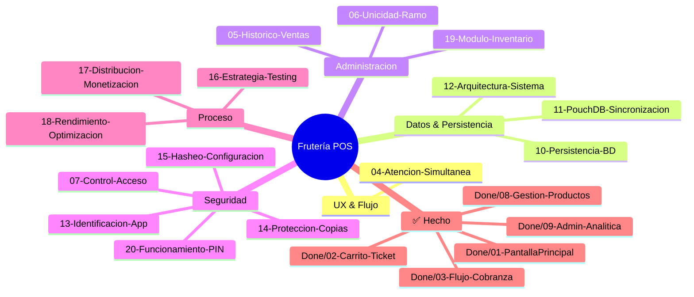
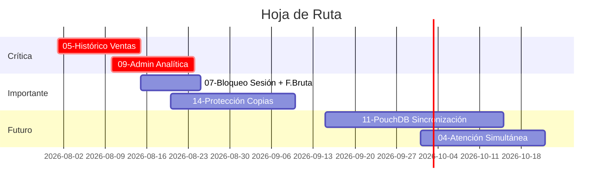

# 🧠 BrainStorm — Frutería POS

> Mapa maestro de ideas, mejoras y hoja de ruta del sistema POS táctil para frutería.
> Cada tema tiene su propio archivo con análisis en profundidad.

---

## 🗺️ Mapa de Temas

---

## 📋 Índice de Temas

## 📋 Índice de Temas

### 🟢 Pendientes / En Progreso

| # | Tema | Estado | Prioridad | Archivo |
|---|------|--------|-----------|---------|
| 04 | Atención Simultánea | 💡 Idea | Media | [📄](04-atencion-simultanea.md) |
| 05 | Histórico de Ventas | 🔍 En análisis | Alta | [📄](05-historico-ventas.md) |
| 06 | Unicidad de Ramo | 💡 Idea | Media | [📄](06-unicidad-ramo.md) |
| 07 | Seguridad y Control de Acceso | 🛡️ Implementado parcial | Alta | [📄](07-seguridad-control-acceso.md) |
| 10 | Persistencia y Base de Datos | 🗄️ Estable | Alta | [📄](10-persistencia-bases-datos.md) |
| 11 | PouchDB y Sincronización | 💡 En evaluación | Baja | [📄](11-pouchdb-sincronizacion.md) |
| 12 | Arquitectura del Sistema (PWA) | ⚡ En evolución | Alta | [📄](12-arquitectura-sistema.md) |
| 13 | Identificación de la App | 💡 Idea | Baja | [📄](13-identificacion-app.md) |
| 14 | Protección contra Copias | 🔍 En análisis | Media | [📄](14-proteccion-copias.md) |
| 15 | Hasheo de Configuración | 💡 Idea | Baja | [📄](15-hasheo-configuracion.md) |
| 16 | Estrategia de Testing | 📋 Pendiente | Media | [📄](16-estrategia-testing.md) |
| 17 | Distribución y Monetización | 💡 Idea | Baja | [📄](17-distribucion-monetizacion.md) |
| 18 | Rendimiento y Optimización | ⚡ Pendiente | Media | [📄](18-rendimiento-optimizacion.md) |
| 19 | Módulo de Inventario | 🔍 En análisis | Alta | [📄](19-modulo-inventario.md) |
| 20 | Funcionamiento del PIN | 🛡️ Implementado | Alta | [📄](20-funcionamiento-pin.md) |

### ✅ Completados (archivados en `Done/`)

| # | Tema | Archivo |
|---|------|---------|
| 01 | Pantalla Principal y UX | [📄](Done/01-pantalla-principal-ux.md) |
| 02 | Carrito y Ticket de Venta | [📄](Done/02-carrito-ticket.md) |
| 03 | Flujo de Cobranza | [📄](Done/03-flujo-cobranza.md) |
| 08 | Gestión de Productos y Categorías | [📄](Done/08-gestion-productos-categorias.md) |
| 09 | Administración y Analítica | [📄](Done/09-administracion-analitica.md) |

**Leyenda:**
- ✅ Completado = Implementado en código, archivado en `Done/`
- 🛡️ Implementado parcial = Funcional pero con mejoras pendientes
- 🔍 En análisis = Evaluando alternativas
- 💡 Idea = Propuesta sin desarrollo
- 📋 Pendiente = Planificado pero sin empezar
- ⚡ En evolución = Cambios activos
- 🗄️ Estable = Funcional, mejora continua

---

## 🎯 Prioridades Actuales

---

## 🧭 Convenciones

- **Tachado** (`~~texto~~`) = implementado completamente
- **Cursiva** (`_texto_`) = en desarrollo o análisis
- **Sin formato** = pendiente / por evaluar
- Cada archivo es **autocontenido** y profundiza un solo tema
- Las referencias entre temas se hacen con enlaces `→ ver [##-tema.md](...)`
